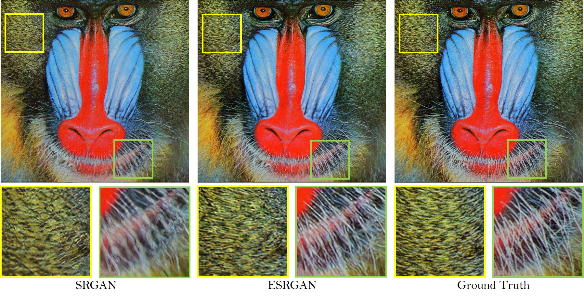

## Super-resoltion:
The demand for high quality images in modern era are crucial, for entertainment and advertising to scientific research and surveillance. However, capturing or producing images with the percfect amount of detail and clarity is often limited by factors such as hardware, or storage constraints. To address this challenge, image super-resolution techniques have developed  as a sustainiable solution to give better resolution and quality of images more than their limitations. The goal of this is to dive  deeper into the concept of image systems, focusing on the evaluation of the ESRGAN. ESRGAN represents a cutting-edge method in image improvement, leveraging deep learning techniques to produce HR images from LR inputs. The introduction sets the stage by stating context on the restoration of image quality in various applications and the limitations of traditional image and processing approaches 

 
**We have gain insights from the research paper mentioned below:**


### Enhanced Super-Resolution Generative Adversarial Networks
By Xintao Wang, [Ke Yu](https://yuke93.github.io/), Shixiang Wu, [Jinjin Gu](http://www.jasongt.com/), Yihao Liu, [Chao Dong](https://scholar.google.com.hk/citations?user=OSDCB0UAAAAJ&hl=en), [Yu Qiao](http://mmlab.siat.ac.cn/yuqiao/), [Chen Change Loy](http://personal.ie.cuhk.edu.hk/~ccloy/)

#### BibTeX

    @InProceedings{wang2018esrgan,
        author = {Wang, Xintao and Yu, Ke and Wu, Shixiang and Gu, Jinjin and Liu, Yihao and Dong, Chao and Qiao, Yu and Loy, Chen Change},
        title = {ESRGAN: Enhanced super-resolution generative adversarial networks},
        booktitle = {The European Conference on Computer Vision Workshops (ECCVW)},
        month = {September},
        year = {2018}
    }

<p align="center">
  
</p>

#### Dependencies
- Python 3
- [PyTorch >= 1.0](https://pytorch.org/) (CUDA version >= 7.5 if installing with CUDA. [More details](https://pytorch.org/get-started/previous-versions/))
- Python packages:  `pip install numpy opencv-python`

### Test models
1. Clone this github repo.
```
git clone https://github.com/xinntao/ESRGAN
cd ESRGAN
```
2. Place your own **low-resolution images** in `./LR` folder. (There are two sample images - baboon and comic).
3. Download pretrained models from [Google Drive](https://drive.google.com/drive/u/0/folders/17VYV_SoZZesU6mbxz2dMAIccSSlqLecY) or [Baidu Drive](https://pan.baidu.com/s/1-Lh6ma-wXzfH8NqeBtPaFQ). Place the models in `./models`. We provide two models with high perceptual quality and high PSNR performance (see [model list](https://github.com/xinntao/ESRGAN/tree/master/models)).
4. Run test. We provide ESRGAN model and RRDB_PSNR model and you can config in the `test.py`.
```
python test.py
```
5. The results are in `./results` folder.

### ESRGAN

1. We have considered a pretrained model of form the repository of Xintao Wang, [Ke Yu](https://yuke93.github.io/), and adopted a deeper model called Residual-in-Residual Dense Block (RRDB) without batch normalization layers.
2. Employed the [Relativistic average GAN](https://ajolicoeur.wordpress.com/relativisticgan/) instead of vanilla GAN.
3. Also improved the perceptual loss using the features before activation.

<p align="center">
  
</p>
<p align="center">
  
</p>


